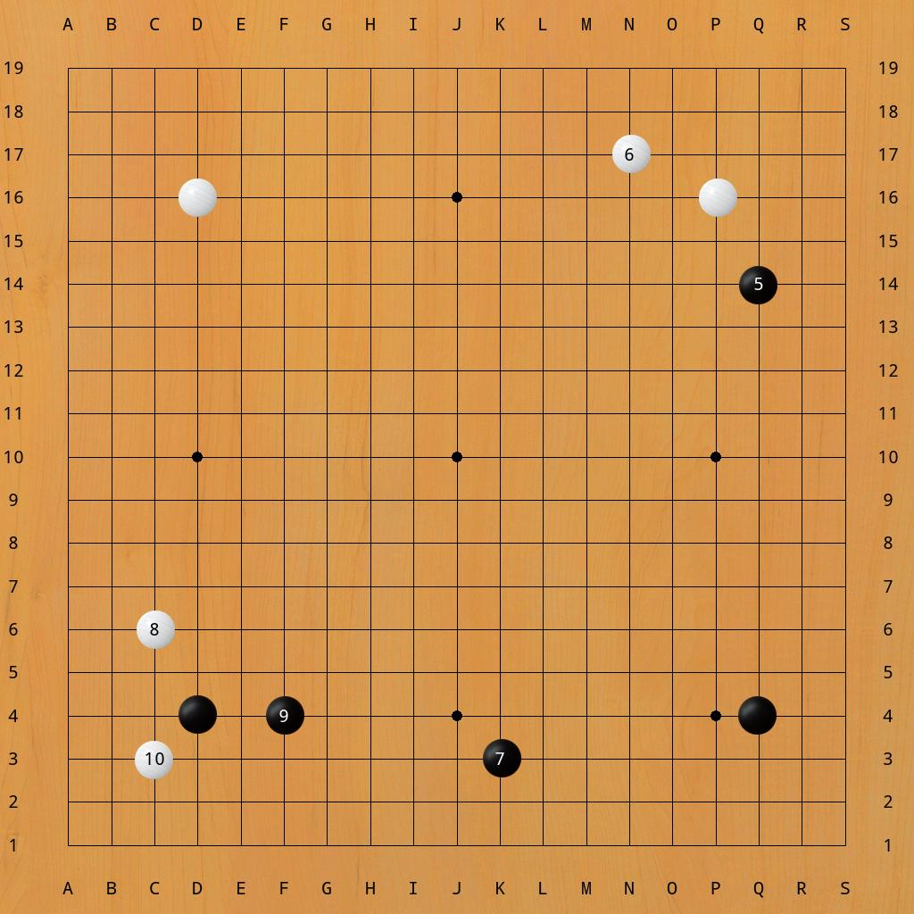
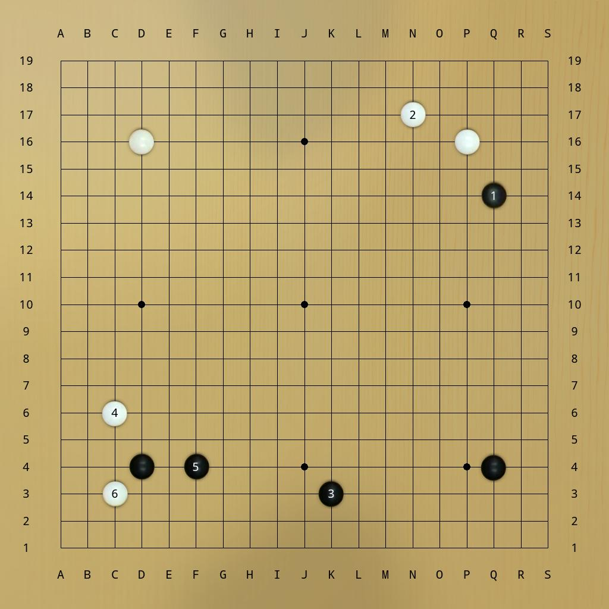

# Usage:
```
usage: sgf2img.py [-h] [--start_number [START_NUMBER]] [--start [START]]
                  [--end [END]] [--theme THEME] [--list_themes]
                  [sgf_name] [image_name]

positional arguments:
  sgf_name              sgf file name
  image_name            output image file name

optional arguments:
  -h, --help            show this help message and exit
  --img_size [IMG_SIZE]
                        set the image size
  --start_number [START_NUMBER]
  --start [START]
  --end [END]
  --theme THEME         default theme is real-stones
  --list_themes
```

# Examples:

`sgf2img.py AlphaGo_AlphaGo_第一局_简体.sgf 1.jpg`


`sgf2img.py AlphaGo_AlphaGo_第一局_简体.sgf koast.jpg --theme koast --start 1`


`sgf2img.py AlphaGo_AlphaGo_第一局_简体.sgf Lizzie-look.jpg --theme Lizzie-look --start 5 --end 10`


`sgf2img.py AlphaGo_AlphaGo_第一局_简体.sgf baduktv.jpg --theme baduktv --start 5 --end 10 --start_number 1`


# About themes
All themes come from [Sabaki](https://github.com/SabakiHQ/Sabaki/) and [KaTrain](https://github.com/sanderland/katrain)
